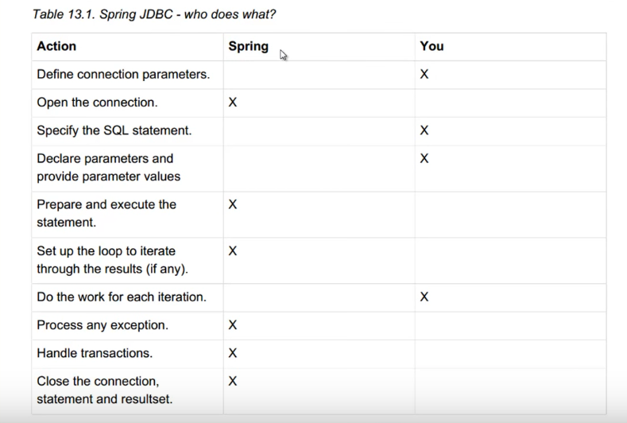

# Spring mit Datenbanken

* Man arbeitet mehr mit fertigen Klassen/Implementierungen/Templates anstatt selbst alles manuell zu machen.
* Verbessertes Exception-Handling
* Ein Großteil der Arbeit übernimmt Spring
* Der Programmierer konzentriert sich mehr auf die einzelnen Transaktionen/Abfragen als auf Aufräumarbeit etc.
* DI / AOP Mechanismen werden verwendet
* Alle negativen Aspekte von z.B. JDBC etc sind berücksichtigt und "verbessert" worden.

## Mehrere verschiedene Schablonen/Templates
* Jdbc Template
* Hibernate Template
* Jpa Template
* Jms Template
* ...

## JDBC - Template:
